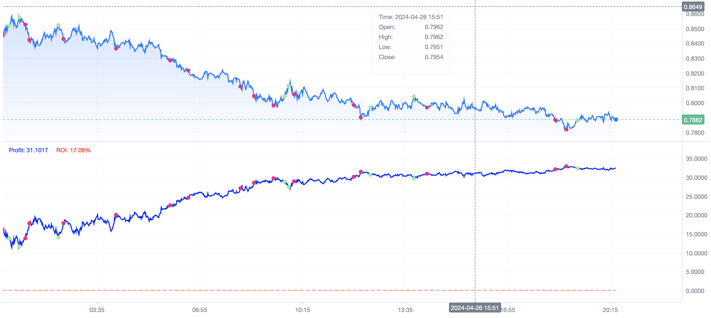

# CryptoTrader
CryptoTrader allows easily development of investment strategies for cryptocurrency. It mainly simulate trading strategies against historical data to evaluate their performance.

## Visualization Demo



CryptoTracker provide a visualization tool to easily trace the performance (i.e., the cumulated net profit) of your strategy.

## Prerequisites

This project uses Python 3.10. Before running this project, ensure you have Python 3.10 installed on your system. Besides, install all required packages by executing the following command:

```bash
pip install -r requirements.txt
```

## Setup

Before running the backtesting process,  configure your directory paths in the `.env.sh` file. This file should contain the following entries:

```bash
export DATA_ROOT=/path/to/your/data/directory/
export RESULTS_ROOT=/path/to/your/results/directory/
```

Replace `/path/to/your/data/directory/` and `/path/to/your/results/directory/` with the actual paths to your data and results directories respectively.

After configuring the paths, execute the following command to load the environment variables:

```bash
source .env.sh
```

## Usage

Before running the backtesting process, you need to specify your strategy configuration in a JSON file. Currently, we support two default strategies:

- **grid_trading**
- **dca**

### Strategy Configuration

This is a sample configuration for **grid_trading**

Create a JSON file named `strategy_config.json`, with the following content:

```json
{
    "name": "grid_trading",
    "config": {
        "budget": 200,
        "leverage": 30,
        "amount": 0.0001,
        "highest": 75000,
        "lowest": 60000,
        "num_interval": 20
    }
}
```

Adjust the parameters according to your desired configuration.

### Backtesting

To initiate the backtesting process, use the following command:

```bash
python main --symbol <SYMBOL> --start_time <START_TIME> --end_time <END_TIME> --fetch_price
```

### Parameters

- `--symbol`: Specifies the cryptocurrency pair you would like to invest in, for instance, `btcusdt`.
- `--start_time`: Specifies the start time for backtesting. Format: YYYY-MM-DD HH:MM:SS.
- `--end_time`: Specifies the end time for backtesting. If not specified, the current time will be used as the end time.
- `--fetch_price`: Optional flag. When included, the program will automatically fetch all required prices for testing on the specified time interval.

### Example

```
python main --symbol btcusdt --start_time "2024-04-05 20:32:00" --end_time "2024-04-14 17:34:00" --fetch_price
```

This command will execute the backtesting process from 20:32:00 April 5th, 2024, to 17:34:00 April 14th, 2024, and fetch all necessary prices for testing.

## Results
The results of the backtesting process will be stored in the specified RESULTS_ROOT directory. You can analyze these results to evaluate the performance of your investment strategy.
